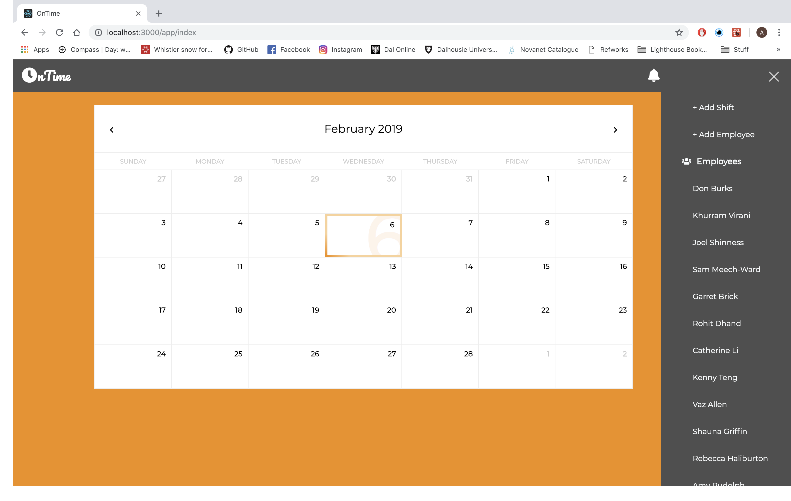
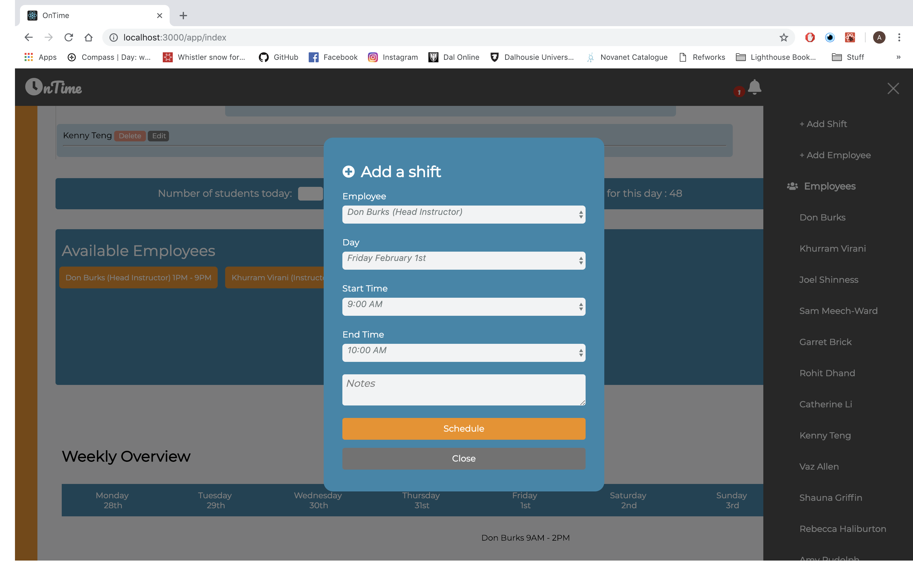
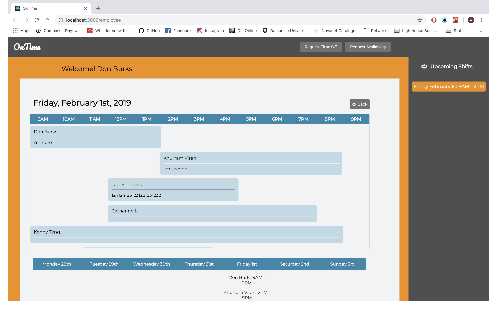

# README

OnTime is scheduling platform built on React / Rails / PostgreSQL. This is a SPA(Single page app) where any employer can schedule with all the information on hand. Employees can also time request off that will help communicate better with Employer.

To use this scheduling platform:

* Clone this repository

* bundle install

* yarn install

* rails s

App will run at `localhost:http://localhost:3000/`

## Stretch Features to work on

* Deploying online
* Better visibility when adding shift popup opens (moving to sidebar maybe)
* Automated scheduling / Finalize schedule / Print version of weekly view / Copy previous schedule

